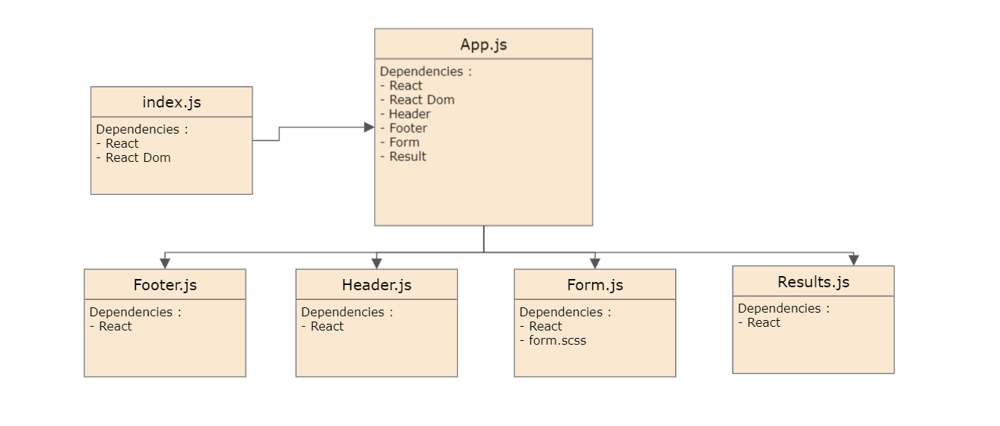
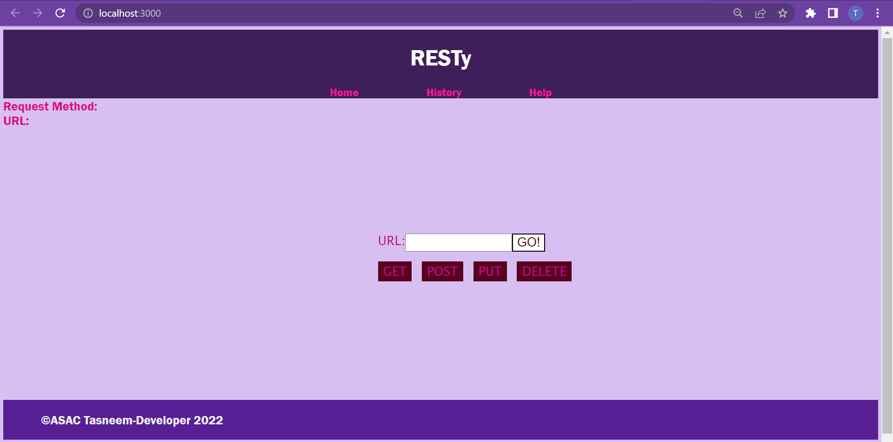
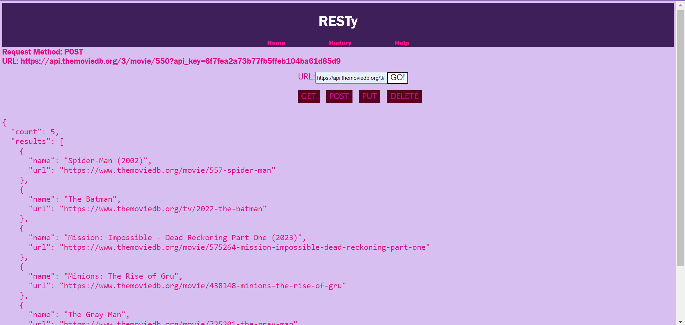
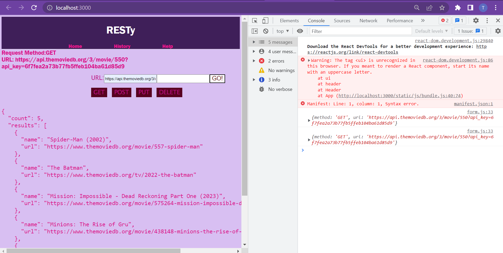
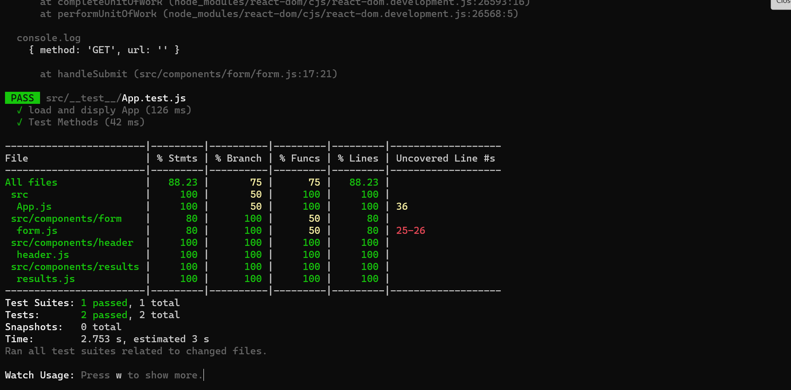
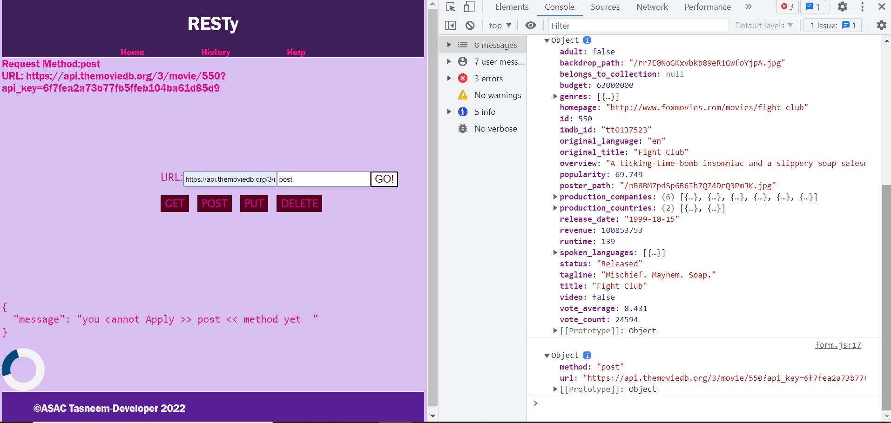
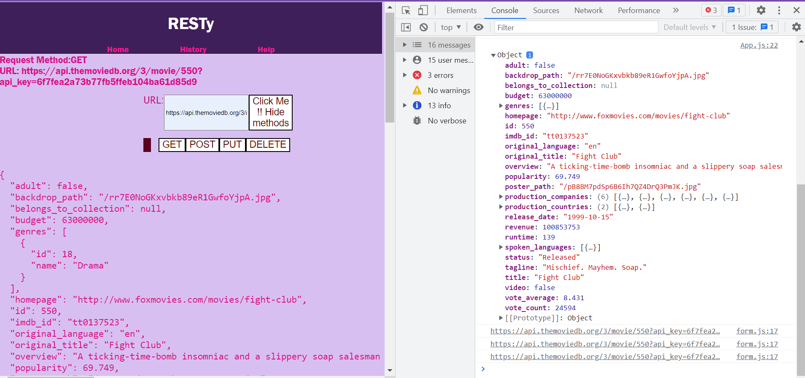

## RESTy

## Deployed Github Pages >>
## [RESTY ](https://engtasneemmaq.github.io/resty/)

## Deployed Netlify >>>
[RESTy](https://62fab59eba055314e2d1bb6b--chic-sherbet-e600ea.netlify.app/)

## UML Diagram

## Result >>>

## Result UseState>>>

## Test RESTy>>>>

## Test RESTy 2

